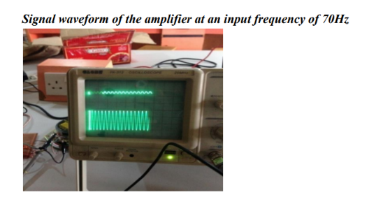

# 🔊 Analog Audio Amplifier with Tone Control, ESP32 MP3 Decoding & Ultrasonic Volume Control

<p align="center">


</p>

---

# 📖 Overview

The **Analog Audio Amplifier with Tone Control, ESP32 MP3 Decoding & Ultrasonic Volume Control** is an embedded electronics project that combines digital audio processing with high-quality analog amplification.

The system uses an **ESP32** to decode MP3 audio files from an SD card and stream them to a **NE5532 active tone control circuit**. The processed signal is then amplified using a **Class-AB Power Amplifier** built with discrete transistors. Two **HC-SR04 Ultrasonic Sensors** enable touchless gesture-based volume and mute control, creating an intuitive Human-Computer Interaction (HCI) experience.

---

# ✨ Features

- 🎵 ESP32 MP3 Audio Playback
- 🎚️ Active Bass & Treble Tone Control
- 🔊 Class-AB Audio Amplifier
- 📀 SD Card Audio Support
- 🤚 Ultrasonic Gesture-Based Volume Control
- 🔇 Touchless Mute Control
- 📈 MATLAB Signal Analysis
- ⚡ Multisim Circuit Simulation
- 🎛️ Low Distortion Audio Output
- 🖥️ Embedded Audio Processing

---

# 🔧 Hardware Requirements

- ESP32 Development Board
- NE5532 Tone Control Module
- BD139 Transistor
- BD140 Transistor
- BC109BP Transistor
- 2N3906 Transistor
- HC-SR04 Ultrasonic Sensors
- Relay Module
- MicroSD Card Module
- Speaker (8Ω)
- Capacitors & Resistors
- Breadboard / PCB
- Jumper Wires
- Power Supply

---

# 💻 Software Requirements

- Arduino IDE
- MATLAB
- NI Multisim
- ESP32 AudioI2S Library

---

# 📂 Project Structure

```text
Analog-Audio-Amplifier-ESP32
│
├── ESP32 Code/
│      amplifier.ino
│
├── MATLAB/
│      signal_analysis.m
│
├── images/
│      circuit diagram.png
│      hardware implementation.png
│      output.png
│      simulation result.png
│
├── Report/
│      Project_Report.pdf
│
├── README.md
├── LICENSE
└── .gitignore
```

---

# ⚙️ Working Principle

1. MP3 files are stored on the SD Card.
2. ESP32 decodes the MP3 audio stream.
3. Audio is transmitted through the I2S interface.
4. NE5532 performs Bass and Treble adjustment.
5. The Class-AB amplifier amplifies the processed audio.
6. HC-SR04 ultrasonic sensors detect hand gestures.
7. Gestures control volume level and mute functionality.
8. High-quality amplified audio is delivered to the speaker.

---

# 📸 Project Images

## Circuit Diagram

<p align="center">

</p>

---

## Hardware Implementation

<p align="center">

</p>

---

## Output Waveform

<p align="center">

</p>

---

## Multisim Simulation Result

<p align="center">

</p>

---

# 🚀 Applications

- Smart Audio Systems
- Home Audio Amplifiers
- Embedded Audio Devices
- Consumer Electronics
- Gesture-Controlled Electronics
- Educational Electronics Projects
- Analog & Digital Audio Processing
- Human-Computer Interaction (HCI)

---

# 🔮 Future Scope

- Bluetooth Audio Streaming
- OLED Display Integration
- Wi-Fi Music Streaming
- Mobile Application Control
- DSP-Based Digital Equalizer
- AI-Based Gesture Recognition
- Voice Assistant Integration
- Class-D Power Amplifier Upgrade

---

# 👨‍💻 Authors

- **Srajan Gupta**
- Saksham Arora
- Daspati Anuraag Prahas
- Surya Pratap Singh

**B.Tech Electronics and Communication Engineering (ECE)**

**VIT Vellore**

GitHub: https://github.com/xsrajangupta

---

## ⭐ Support

If you found this project useful, consider giving it a **⭐ Star** on GitHub!

It motivates me to build and share more open-source embedded systems and electronics projects.
